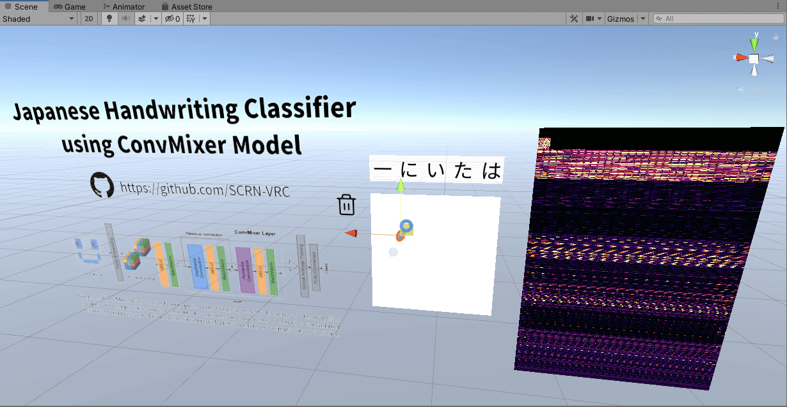

# Japanese Handwriting Classification with Fragment Shaders



### NOTE: This was built and tested with Unity 2019.4.31f1 using built-in render pipeline, there may be shader compatibility issues with other versions.

## Table of Contents
- [Overview](#overview)
- [ConvMixer](#convmixer)
- [Problems](#problems)
- [Setup](#setup)
- [Python, C++ Code](#python-c-code)
- [Resources](#resources)
- [Datasets](#datasets)

## Overview

Japanese handwriting classification using a new and compact convolution model converted into fragment shaders to be used inside VRChat or Unity. This is general image classification system and does not use stroke order to predict the characters. It recognizes up to 3225 Japanese characters.

This is part of my [Language Translation System](https://github.com/SCRN-VRC/Language-Translation-with-Fragment-Shaders) where it will serve as input to the Japanese translation model.

## ConvMixer


The name comes from the paper [Patches Are All You Need](https://openreview.net/pdf?id=TVHS5Y4dNvM) where it mixes ideas from Vision Transformers into a pure convolutional network.

The basic idea is to break down the input image into patches, and run it through layers of depth-wise and point-wise convolutions. But unlike standard convolutional models, the ConvMixer architecture does not downsample successive layers, it keeps all layers the same size.

This JP handwriting classification network uses ConvMixer-144/4, with a depth of 5.

## Problems

- The [ETL Handwritten Japanese Character Database](http://etlcdb.db.aist.go.jp/) I used to train this did not cover all 3225 characters the translator can recognize. To fill the missing characters, I used different Japanese fonts. But handwriting and fonts are not always the same.
- The model overfits the training data too easily, I had to lower the learning rate and weight decay and added Dropout Layers.
- Not OCR, only one character at a time.
- I made it a very simple network to keep the performance high in VR.

## Setup

1. Download the latest .unitypackage from [Release](https://github.com/SCRN-VRC/Japanese-Handwriting-Classification-with-Fragment-Shaders/releases) and import it.
2. Look in the Prefab folder and add the `JPHandwriteClassifier.prefab` in the world or avatar.
3. Check if the network works in Playmode.

The class predictions are rendered to `Textures\RenderTextures\OutputLayersBuffer.renderTexture`. You can read it in a shader by importing the .cginc `Shaders\ConvMixer\ConvMixerModel.cginc`

```C
#include "ConvMixerModel.cginc"
```
and assuming `_RenderTexture` contains `OutputLayersBuffer.renderTexture`
```C
Texture2D<float> _RenderTexture;

...

float firstPrediction = _RenderTexture[txTop1.xy];
float secondPrediction = _RenderTexture[txTop2.xy];
float thirdPrediction = _RenderTexture[txTop3.xy];
float fourthPrediction = _RenderTexture[txTop4.xy];
float fifthPrediction = _RenderTexture[txTop5.xy];
```

This is only if you want to edit the shaders, the prefabs should work out the box.

### Python, C++ Code

- Python
    - https://keras.io/examples/vision/convmixer/
    - My Python code is a copy of the tutorial linked above but modified to spit out intermediate layer outputs and trained with a different dataset. It's better to follow the tutorial linked above than try to run mine.
    - Model weights in Keras .h5 format: [here](https://github.com/SCRN-VRC/Japanese-Handwriting-Classification-with-Fragment-Shaders/tree/main/Python/model)
    - It's weights only so you'll need to setup the model like this before loading the weights
```Python
conv_mixer_model = get_conv_mixer_256_8(image_size=64,
                                        filters=144,
                                        depth=4,
                                        kernel_size=5,
                                        num_classes=3225)
```

- C++
    - Requires [stb_image.h](https://github.com/nothings/stb/blob/master/stb_image.h)
    - Windows, for non-Windows platforms remove the Windows.h include.